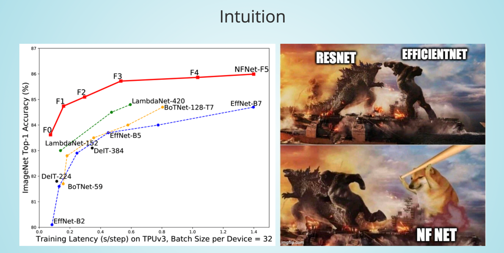
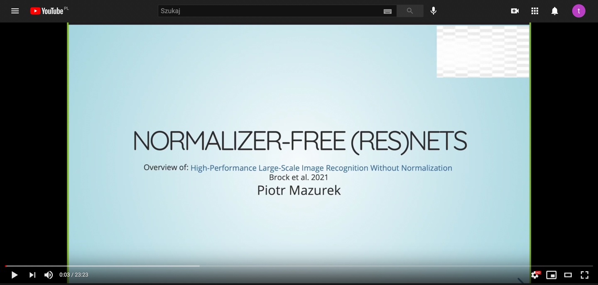

# NF-Nets-Presentation

Presentation on Normalizer-Free (Res)Nets conducted at Wrocław University of Science and Technology on 10 March. 2021.

We discuss findings presented in [High-Performance Large-Scale Image Recognition Without Normalization](https://arxiv.org/pdf/2102.06171.pdf) by Brock et al. and some earlier works. We introduce the concept of NF Net and we evaluate its advantages and disadvantages. 

Presentation avalible at: [tugot17.github.io/NF-Nets-Presentation](https://tugot17.github.io/NF-Nets-Presentation/#/)

## Video Summary

Video summary (unfortunately due to the course rules it is **in Polsih not in English**) avalible here:  

## TL;DR
Normalizer-Free (NF) Net is a new class of deep neural network architectures that currently (March 2021) is considered to be a SOTA solution for image classification. Its biggest version - B6 achieves 86.5% top-1 and 97.9% top-5 accuracies on the ImagNet dataset. Smaller versions match the performance achieved by the previous SOTA network - Efficientnet while having considerably faster training step time. 

Authors extend their previous work presented in [Characterizing signal propagation to close the performance gap in unnormalized ResNets](https://arxiv.org/abs/2101.08692), in which they have shown that it is possible to build "ResNet-like" models without using Batch Normalization layer that matches the performance of traditional ResNets. 

Eliminating batch normalization is important because the normalization operation while being extremely useful comes at a great expense. It is very slow to compute due to the limitations of modern GPUs and it breaks the independence between training examples in the minibatch. Those two factors were the reason why Brock et al. decided to eliminate the BN layer from their network. 

In NF Nets paper authors propose additional improvement - Adaptive Gradient Clipping (AGC). AGC smoothens the training by eliminating too big gradient steps and enables the use of larger data batches (> 2048). This technique makes NF nets competitive with EfficientNet as far as large-scale training is considered.

Additionally to AGC authors propose a new network architecture. They build on top of SE-ResNeXt-D, extend its size and add a few extra tweaks. The final version is a new SOTA for the task of image classification, however, it is not clear whether it is the use of AGC of the new architecture that enabled this leap. 

Although the new solution beats efficientnet on Imagenet it is worth mentioning that it achieves that by requiring considerably more resources (measured as the number of FLOPs) which in our opinion is far optimal. There is a need for an "efficinetnet-like" grid search for a new optimal architecture that will make use of ACG while preserving the largest EfficientNet advantage - compact size. 

We speculate (in March 2021) that in the next few months NF Net will become a backbone of a new series of SOTA models for object detection and segmentation and the new paradigm  - normalization free nets will enable to accelerate the training time  of the future "GPT like" models 

## Author

- [Piotr Mazurek](https://github.com/tugot17)
